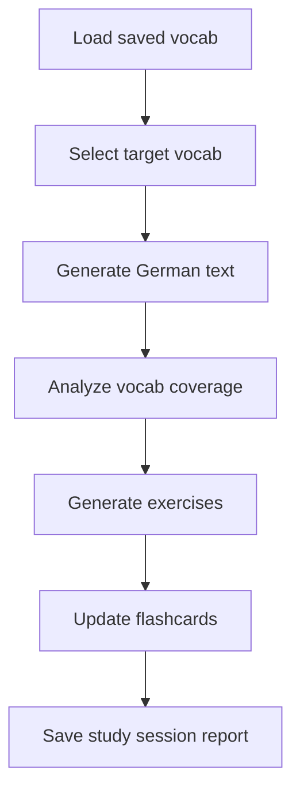
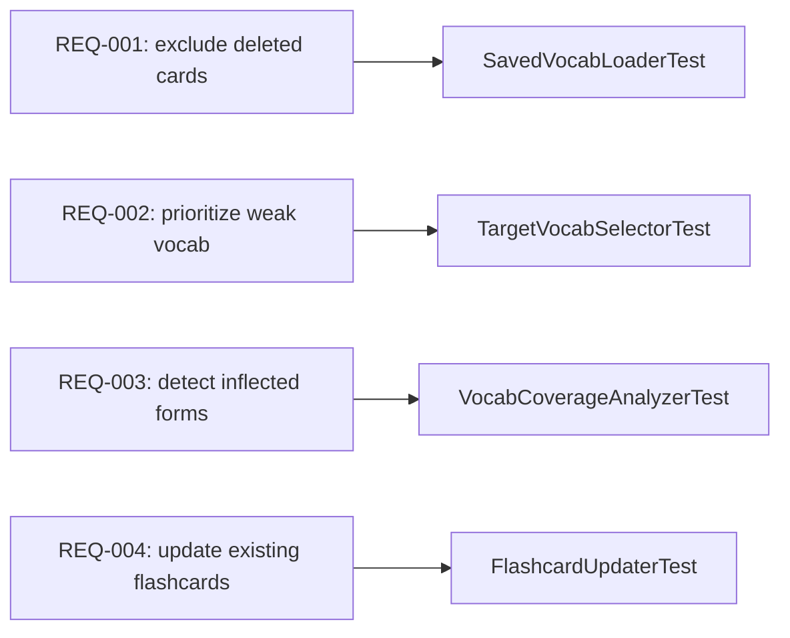
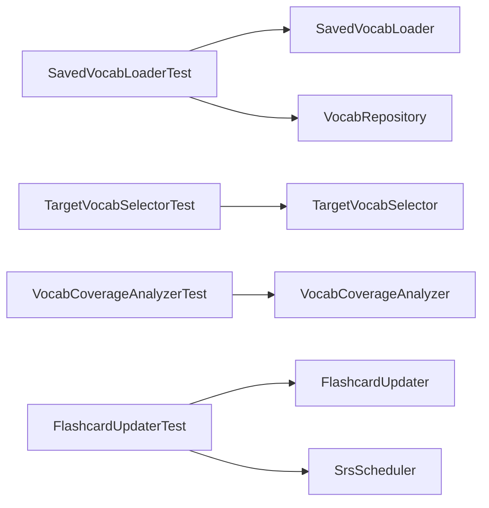

# Backend Feature Contract Instructions

(Contract-First Feature Planning for LLM-Guided Backend Development)

## Purpose

This document defines how backend features must be planned before tests or production code are generated.

A feature contract is a visible, human-reviewable artifact that describes:

- what the feature must do
- which behavioral steps exist
- what each step receives and returns
- which guarantees must be tested
- which test strategy is appropriate for each step
- where mocking is allowed or forbidden
- which visibility artifacts must be maintained

The goal is to reduce uncertainty in LLM-generated backend work by forcing feature intent to become explicit before implementation begins.

---

## Core Rule

For every non-trivial backend feature, the LLM must create or update a feature contract before generating:

- production code
- tests
- mocks
- database migrations
- API/controller changes
- integration flows

The LLM must not implement the feature until the contract exists.

---

## What Counts as a Non-Trivial Feature

A feature is non-trivial if it includes at least one of the following:

- more than one behavioral step
- persistence or database interaction
- API/controller changes
- external service interaction
- asynchronous/event behavior
- LLM/model interaction
- security or authorization behavior
- state transitions
- scheduling/retry/idempotency behavior
- flashcard/SRS/business-rule updates
- generated text/content/output that must be validated
- cross-module behavior
- behavior that requires integration/system tests

Small mechanical changes do not require a full feature contract, but the LLM must still preserve existing test and architecture rules.

---

## Source of Truth Rule

The feature contract is the source of truth for new feature behavior.

Tests must be generated from the feature contract, not inferred from production code.

Production code must be generated to satisfy the tests and contract, not the other way around.

---

## Required Feature Contract Location

Each project using these guidelines should store feature contracts in a project-local folder such as:

```text
.featureflow/features/<feature-id>/feature.contract.yaml
```

Recommended related files:

```text
.featureflow/features/<feature-id>/
  feature.contract.yaml
  test.plan.yaml
  fixtures/
  traceability.report.yaml
  visibility/
    system-behavior.yaml
    feature-flow.mmd
    requirement-test-map.mmd
    test-code-map.mmd
```

The exact folder may differ per project, but the project must keep feature contracts visible and version-controlled.

Backend traceability mapping (this guideline set):
- If project uses backend markdown trace artifacts, map visibility/test planning outputs to:
  - `backend/test-trace/plans/<FEATURE_ID>.plan.md`
  - `backend/test-trace/final/<FEATURE_ID>.final.md`
  - `backend/test-trace/changes/<FEATURE_ID>.changes.md`
- YAML and markdown formats are both acceptable if mapping is explicit and complete.
- A project must choose one primary trace mode per feature:
  - Mode A: `.featureflow/...` YAML/JSON artifacts
  - Mode B: `backend/test-trace/...` markdown artifacts
- Mixed partial modes for the same feature are forbidden unless explicit mapping is documented.

---

## Required Contract Fields

A feature contract must include:

- `feature.id`
- `feature.name`
- `goal.summary`
- `inputs`
- `outputs`
- `flow`
- `requirements`
- `test_strategy`
- `mock_policy`
- `visibility`
- links to required visibility files
- links to canonical behavior graph
- requirement IDs that can be mapped to tests
- behavior-step IDs that can be mapped to code modules

Each flow step must define:

- step id
- behavior
- input
- output
- required guarantees
- preferred test type
- isolation strategy
- mock policy

---

## Minimal Feature Contract Template

```yaml
feature:
  id: example_feature_id
  name: Human-readable feature name
  status: draft

goal:
  summary: >
    Describe the feature outcome in business/user terms.

inputs:
  - input_name

outputs:
  - output_name

flow:
  - id: first_behavior_step
    behavior: Describe what this step does.
    input:
      - input_name
    output:
      - intermediate_output
    must:
      - declared_requirement_one
      - declared_requirement_two
    test_strategy:
      primary: pure_unit | direct_behavior | boundary_contract | integration | system | llm_eval
      isolation: pure | boundary_isolated | composed_runtime | real_infrastructure | mocked_external_boundary
      mock_policy: no_mocks | external_only | already_tested_behavior_only

  - id: second_behavior_step
    behavior: Describe what this step does.
    input:
      - intermediate_output
    output:
      - final_output
    must:
      - declared_requirement_three
    test_strategy:
      primary: direct_behavior
      isolation: pure
      mock_policy: no_mocks

requirements:
  - id: REQ-001
    behavior_step: first_behavior_step
    guarantee: Describe the exact behavior guarantee.
    risk: low | medium | high | critical

  - id: REQ-002
    behavior_step: second_behavior_step
    guarantee: Describe the exact behavior guarantee.
    risk: low | medium | high | critical

test_strategy:
  phases:
    - direct_behavior_tests
    - boundary_contract_tests
    - integration_or_composition_tests
    - system_tests_for_critical_journeys_only
    - llm_or_quality_evals_when_needed

mock_policy:
  default: do_not_mock_business_behavior
  allowed_when:
    - dependency_is_external_or_nondeterministic
    - dependency_behavior_is_already_directly_tested
    - test_does_not_claim_to_verify_mocked_behavior
  forbidden_when:
    - dependency_contains_business_rule_under_test
    - dependency_contains_persistence_semantics_under_test
    - dependency_contains_contract_semantics_under_test
    - mock_is_used_only_for_convenience

visibility:
  required_views:
    - feature_flow
    - requirement_to_test_map
    - test_to_code_map
    - affected_test_map
  canonical_source:
    - feature.contract.yaml
    - test.plan.yaml
    - test-registry.json
    - traceability.report.yaml
```

---

## Test Generation Order

For a contracted feature, tests must be generated in this order:

1. Direct behavior tests for deterministic rules and business guarantees.
2. Boundary/contract tests for mappings, APIs, persistence contracts, messages, and adapters.
3. Integration/composition tests for already-tested behaviors working together.
4. System tests only for declared critical backend journeys.
5. LLM/evaluation tests only when behavior depends on generated content or nondeterministic model output.

The LLM must not jump directly to broad integration or system tests when lower-level behavior has not yet been tested.

---

## Mock Permission Rule

Before using a mock, fake, stub, `@Mock`, `@MockBean`, fake repository, or fake service, the LLM must answer:

1. What behavior is this test verifying?
2. What behavior is intentionally excluded by the mock?
3. Which lower-level test already verifies the mocked behavior?
4. Would using real behavior provide better confidence?
5. Is the mocked dependency external, nondeterministic, slow, or outside the feature boundary?

If the mocked behavior is not already directly tested and is part of the feature guarantee, the mock is forbidden.

---

## Visibility Layer Rule

Every non-trivial feature must maintain a visibility layer.

The visibility layer must allow a human or coding agent to inspect:

- feature flow
- declared requirements
- tests proving each requirement
- code modules implementing each behavior
- likely affected tests when code changes

The visibility layer must be generated from canonical artifacts in the selected trace mode.

Diagrams such as Mermaid or PlantUML are views, not the source of truth.

---

## Required LLM Behavior

When asked to design, test, or implement a non-trivial backend feature, the LLM must:

1. Create or update feature contract artifact (for example: `feature.contract.yaml`).
2. Create or update test planning artifact:
   - Mode A: `test.plan.yaml`
   - Mode B: `backend/test-trace/plans/<FEATURE_ID>.plan.md`
3. Create or update fixtures or example data.
4. Create or update traceability final artifact:
   - Mode A: `traceability.report.yaml`
   - Mode B: `backend/test-trace/final/<FEATURE_ID>.final.md`
5. Create or update test landscape change artifact:
   - Mode A: registry/report updates
   - Mode B: `backend/test-trace/changes/<FEATURE_ID>.changes.md`
6. Define direct behavior tests before integration or system tests.
7. Justify every mock.
8. Generate tests from the contract.
9. Generate production code only after tests are planned.
10. Update visibility projections (diagrams/maps) where used.
11. Produce a human-review summary.

The LLM must not claim that a non-trivial feature is planned unless selected planning/visibility artifacts exist.

The LLM must not claim that a non-trivial feature is complete unless selected trace artifacts and visibility layer are updated.
---

## Final Invariant

A backend feature is not considered ready merely because code compiles or tests pass.

A backend feature is ready only when:

- the feature contract exists
- requirements are explicit
- tests map to requirements
- mocks are justified
- implementation maps to tested behavior
- visibility artifacts show what the system does
- future affected tests can be identified from trace artifacts

---

## Mandatory Trace Artifact Generation

For every non-trivial backend feature, the LLM must generate actual version-controlled trace artifacts.

The feature must not remain only in chat, prose, comments, or generated source code.

Mode A (`.featureflow`) required artifacts are:

```text
.featureflow/features/<feature-id>/
  feature.contract.yaml
  test.plan.yaml
  fixtures/
  visibility/
    system-behavior.yaml
    feature-flow.mmd
    requirement-test-map.mmd
    test-code-map.mmd
```

Mode A also requires:

```text
.featureflow/features/<feature-id>/
  traceability.report.yaml

.featureflow/registry/
  test-registry.json
```

Mode B (`backend/test-trace`) required artifacts are:

```text
backend/test-trace/plans/<FEATURE_ID>.plan.md
backend/test-trace/final/<FEATURE_ID>.final.md
backend/test-trace/changes/<FEATURE_ID>.changes.md
```

These files are mandatory for every non-trivial feature in the selected mode.

If the files do not exist, the LLM must create them.

If the files already exist, the LLM must update them instead of creating disconnected duplicates.

---

## Canonical Behavior Source Rule

The canonical source of truth for feature behavior must be explicit and version-controlled in selected trace mode.

Mermaid, PlantUML, SVG, PNG, or dashboard views are visual projections of canonical artifacts.

The LLM must not create diagrams as independent undocumented artifacts.

Mode A canonical files are:

```text
feature.contract.yaml
test.plan.yaml
visibility/system-behavior.yaml
test-registry.json
traceability.report.yaml
```

Mode A visual files are:

```text
visibility/feature-flow.mmd
visibility/requirement-test-map.mmd
visibility/test-code-map.mmd
```

Optional visual files may also be generated:

```text
visibility/feature-flow.puml
visibility/requirement-test-map.puml
visibility/test-code-map.puml
```

Mode B canonical files are:

```text
backend/test-trace/plans/<FEATURE_ID>.plan.md
backend/test-trace/final/<FEATURE_ID>.final.md
backend/test-trace/changes/<FEATURE_ID>.changes.md
```

The visibility layer must allow a human or coding agent to inspect:

1. what the feature does
2. which behavior steps exist
3. which inputs and outputs move between steps
4. which requirements belong to each step
5. which tests prove each requirement
6. which code modules implement each behavior
7. which tests may be affected by future code changes

---

## Required Visibility Views

Every non-trivial feature must expose at least three visual views.

### 1. Feature Flow View

File:

```text
.featureflow/features/<feature-id>/visibility/feature-flow.mmd
```

Purpose:

Shows the step-by-step behavior flow of the feature.

Example:



This view answers:

```text
What does this feature do from start to finish?
```

---

### 2. Requirement-to-Test View

File:

```text
.featureflow/features/<feature-id>/visibility/requirement-test-map.mmd
```

Purpose:

Shows which tests prove which requirements.

Example:



This view answers:

```text
Which tests prove this behavior?
```

---

### 3. Test-to-Code View

File:

```text
.featureflow/features/<feature-id>/visibility/test-code-map.mmd
```

Purpose:

Shows which production modules are covered or targeted by which tests.

Example:



This view answers:

```text
If this code changes, which tests and behaviors may be affected?
```

---

## Required `system-behavior.yaml`

Every feature must include a canonical behavior graph.

File:

```text
.featureflow/features/<feature-id>/visibility/system-behavior.yaml
```

Minimum shape:

```yaml
system_behavior:
  feature_id:
  feature_name:

nodes:
  - id:
    type: behavior_step
    label:
    requirements: []
    tests: []
    code: []

edges:
  - from:
    to:
    meaning:
```

Example:

```yaml
system_behavior:
  feature_id: german_vocab_text_generation
  feature_name: Generate German text from saved vocabulary

nodes:
  - id: load_saved_vocab
    type: behavior_step
    label: Load saved vocabulary
    requirements:
      - REQ-001
    tests:
      - T-GER-001
    code:
      - SavedVocabLoader.java
      - VocabRepository.java

  - id: select_target_vocab
    type: behavior_step
    label: Select target vocabulary
    requirements:
      - REQ-002
    tests:
      - T-GER-002
    code:
      - TargetVocabSelector.java

  - id: generate_german_text
    type: behavior_step
    label: Generate German text
    requirements:
      - REQ-003
    tests:
      - T-GER-003
    code:
      - GermanTextGenerationService.java
      - GermanTextGenerationClient.java

  - id: analyze_vocab_coverage
    type: behavior_step
    label: Analyze vocabulary coverage
    requirements:
      - REQ-004
    tests:
      - T-GER-004
    code:
      - VocabCoverageAnalyzer.java

edges:
  - from: load_saved_vocab
    to: select_target_vocab
    meaning: candidate_vocab_items

  - from: select_target_vocab
    to: generate_german_text
    meaning: selected_vocab_items

  - from: generate_german_text
    to: analyze_vocab_coverage
    meaning: generated_text

  - from: analyze_vocab_coverage
    to: generate_exercises
    meaning: vocab_coverage_report
```

`system-behavior.yaml` is the canonical graph.

Mermaid and PlantUML diagrams must be generated from this behavior graph whenever possible.

---

## Required Planning Stop Point

When asked to design or plan a non-trivial backend feature, the LLM must stop after generating the planning and visibility artifacts unless the user explicitly asks for tests or implementation.

Mode A planning phase output must include:

```text
.featureflow/features/<feature-id>/feature.contract.yaml
.featureflow/features/<feature-id>/test.plan.yaml
.featureflow/features/<feature-id>/fixtures/
.featureflow/features/<feature-id>/visibility/system-behavior.yaml
.featureflow/features/<feature-id>/visibility/feature-flow.mmd
.featureflow/features/<feature-id>/visibility/requirement-test-map.mmd
.featureflow/features/<feature-id>/visibility/test-code-map.mmd
```

Mode B planning phase output must include:

```text
backend/test-trace/plans/<FEATURE_ID>.plan.md
```

After generating these files, the LLM must explain what the human should review before tests or implementation are generated.

The human review should focus on:

- whether the feature flow is correct
- whether inputs and outputs are correct
- whether requirements are complete
- whether the test strategy is appropriate
- whether mock permissions are justified
- whether the visibility diagrams match the intended system behavior
